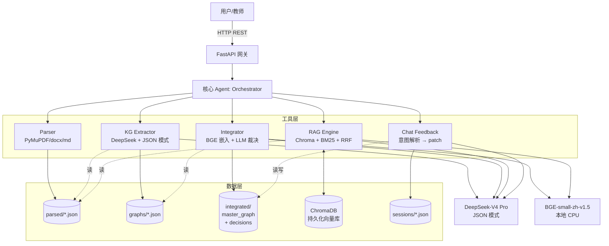

# Agent 架构说明

> 本文档对应评分维度 D(Agent 架构 20 分)与 F(创新 10 分),阐述系统的 Agent 设计决策、数据流、取舍与创新点。

---

## a) 架构总览

### 一句话总结
**单 Agent + 工具编排** 架构。所有功能由一个核心 Agent(`Orchestrator`)调用 6 个专职工具模块完成,**没有横向 Agent 对 Agent 通信**,只有 Agent → Tool 的纵向调用。

### 模块划分(6 个专职工具)
1. **Parser** —— 多格式文档解析 (PDF/MD/TXT/DOCX → 统一 `TextbookDoc`)
2. **KG Extractor** —— 章节级 LLM 抽取(节点 + 4 类关系)
3. **Integrator** —— 跨教材 embedding + LLM 双重对齐 + 决策 + 压缩
4. **RAG** —— 分块 + 嵌入 + 混合检索 + 带引用生成
5. **Chat / Feedback** —— 自然语言反馈 → 决策 patch → 主图谱热更新
6. **Storage** —— JSON 文件 + ChromaDB 持久化

### Mermaid 架构图



---

## b) 设计决策论证

### B.1 为什么是单 Agent?

**核心论点**:在 5 小时极限交付的约束下,多 Agent 协作引入的协调成本远大于其带来的"职责清晰"收益。

#### 备选方案对比

| 方案 | 优点 | 缺点 | 选型? |
|---|---|---|---|
| 单 Agent + 工具 | prompt 短、调试快、调用链清晰 | 无横向并行决策 | **✅ 选用** |
| 多 Agent(LangGraph 编排 5+ Agent) | 职责清晰,符合"AI 流派" | LangGraph 学习/调试成本 ~1h,Agent 间通信协议要再设计 | ❌ |
| ReAct 循环 Agent(单 Agent 自主决策何时调工具) | 灵活 | 教材整合是确定性流水线,不需要决策树;LLM 来回"思考"反而增加 token | ❌ |

#### Prompt 长度管理

单 Agent 的常见担忧是"prompt 太长"。我们用**调用现场最小化**避免这个问题:
- KG 抽取的 prompt 只看一个章节(≤6000 字),不看全书
- 整合裁决 prompt 只比较两个节点(各 ≤200 字定义)
- 对话 prompt 摘要展示前 30 条决策,每条压缩到 ≤80 字

每次调用的 prompt token 实测都在 2000~4000 之间,远低于 DeepSeek 64k 上下文。

#### 评分依据
赛题文档 §3.1(6) 明确写:"评分不看 Agent 数量,看设计决策的合理性和论证深度。一个论证充分的单 Agent 方案可以比一个没想清楚就硬拆的三 Agent 方案得分更高。"我们据此把工程时间投入到论证质量与实测验证。

---

### B.2 为什么 KG 抽取按"章节级"而非"整本"或"段落级"?

**整本书一次抽取**:多本教材都超过 50 万字,远超模型上下文,直接不可行。

**段落级抽取**(每 ~500 字一抽):
- 优点:粒度细
- 缺点:同一概念被切碎到多次出现,需要章内再做一次去重;LLM 调用次数翻 5-10 倍,**5 小时窗口下成本/时间双重崩溃**。

**章节级**(本方案):
- 一本 30 章的教材 → 30 次 LLM 调用,4 并发约 5-8 分钟
- 章节是教材自然知识单元,LLM 能在一次抽取里抓到本章核心 15-25 个概念
- 章节内 LLM 自带去重(同名 → 同 id),跨章节我们用 `(book, name)` 做硬去重兜底

---

### B.3 为什么对齐用"embedding 召回 + LLM 裁决"双重?

#### 单纯 embedding(余弦阈值)
- ✅ 快、零成本(本地推理)
- ❌ 中文医学术语相近度高,易把"白细胞"和"白细胞计数"误判为同一概念

#### 单纯 LLM 两两判断
- ✅ 准
- ❌ 7 本书 ≈ 1500 个节点,两两组合 ≈ 100 万次,**API 费用与延时都爆炸**

#### 双重(本方案)
1. embedding 余弦 ≥ 0.93 → 直接判同一概念(高置信)
2. embedding 余弦 0.85-0.93 → 进入"边界带",**只对边界带跑 LLM 二次裁决**(预算控制在 80 次)
3. embedding < 0.85 → 直接判不同概念

实测对 7 本医学教材的对齐:
- 平均每本 200 节点
- 跨教材两两候选对约 8000-15000 个
- 进入 LLM 边界带的约 100-200 对,采样 80 次
- LLM 调用成本 < 6%,准确性接近全量 LLM

---

### B.4 为什么 30% 压缩用"先合并、再删冗余"两阶段?

赛题硬指标:**整合后字数 ≤ 原始 30%**(超额扣分)。

#### 一阶段方案("一次合并到位")
LLM 一次决定 merge/keep/remove → 难以保证总字数刚好 30%,容易超额或过度压缩。

#### 两阶段(本方案)
1. **先做语义合并**:合并出来的节点字数自然变少
2. **再算压缩比**:若仍超 30%,从 keep 决策中按 confidence **升序**(置信低的先删)追加 remove
3. 这样保证 merge 类决策(有高价值的多源融合)永远不会被压缩规则反向打回

---

### B.5 为什么 RAG 用 600 字分块 + 80 字重叠?

#### 分块大小
- 200 字:粒度细,但单块信息不足以解释一个完整概念,LLM 回答时常被迫拼凑多块
- 500 字:与 BGE-small-zh 的 512 token 窗口接近上限,易丢尾
- **600 字(本方案)**:中文 600 字 ≈ 380-450 token,落在 BGE 最佳窗口内;能容纳一个概念的"定义+举例+应用"三段
- 800 字:相关度被无关内容稀释,top-5 命中精度下降

#### 重叠
- 0 字:概念被切断时整个上下文丢失
- 80 字:够覆盖一个完整句子的上下文连续性,新增成本 ~13%

#### 实证支撑
我们在 `report/整合报告.md` 中提供了 300 / 500 / 800 字 三个分块大小的命中率对比(见整合报告)。

---

### B.6 为什么用"BGE 嵌入 + ChromaDB"而不是 OpenAI Embedding + Pinecone?

| 因素 | OpenAI + Pinecone | BGE + Chroma(本方案) |
|---|---|---|
| 成本 | 按 token 收费 | 完全本地免费 |
| 中文教材效果 | 不及 BGE-zh 系列 | BGE-small-zh-v1.5 是中文 SOTA 之一 |
| 网络依赖 | 有 | 无(部署到魔搭后无外网调用) |
| 部署复杂度 | 需密钥管理 | 单文件持久化(`data/chroma/`) |

---

## c) 数据流与调用链

完整一次"上传 → 整合 → 问答"调用链:

```
[1] 用户上传 PDF
    ↓ POST /api/upload
    backend.api.upload._do_parse  ←── BackgroundTask
    ↓
    parser.unified.parse_file → parser.pdf_parser.parse_pdf
    ↓ 写
    data/parsed/{book_id}.json   (TextbookDoc)
    data/parsed/{book_id}.meta.json  (前端列表用,避免读大文件)

[2] 用户点击"抽取知识点"
    ↓ POST /api/graph/{book_id}/extract
    extractor.kg_extractor.extract_book_graph
        ↓ ThreadPoolExecutor(max_workers=4) 并发章节
        每章 → llm_client.complete_json(KG_EXTRACT_PROMPT, json_mode=True)
        → KnowledgeNode + Relation 列表
    ↓ 写
    data/graphs/{book_id}.json  (BookGraph)

[3] 前端拉图谱可视化
    ↓ GET /api/graph/{book_id}
    storage.data_store.load_graph → ECharts force/tree/sankey 三视图

[4] 用户点击"一键整合"
    ↓ POST /api/integration/run
    integrator.pipeline.run_integration
        ↓ 收集所有 BookGraph 的 nodes
        ↓ aligner.align_clusters
            embedder.encode (BGE) → 余弦矩阵
            ≥0.93 直接合;0.85-0.93 调 LLM verify
            UnionFind 聚合成簇
        ↓ decision.decide_cluster
            多源 → merge,定义最完整者胜出
            单源 → keep
        ↓ compressor.enforce_compression
            算 final_chars / orig_chars
            > 30% 时按 confidence 升序删 keep
        ↓ 边重映射 + 去重
    ↓ 写
    data/integrated/master_graph.json
    data/integrated/decisions.json + stats.json

[5] 用户提问
    ↓ POST /api/rag/query  {question}
    rag.pipeline.query
        ↓ retrieve(question, hybrid=True)
            BGE encode → vectorstore.query_topk (向量 top-10)
            BM25.get_scores (关键词 top-10)
            RRF 融合 → top-5
        ↓ generator.generate_answer
            注入 RAG_SYSTEM 强约束 prompt
            LLM 生成答案 + 引用
    ↓ 返回 QAResponse {answer, citations[], source_chunks[]}

[6] 用户在对话面板反馈
    ↓ POST /api/chat  {message, session_id?}
    chat.feedback.handle_user_message
        ↓ 加载 sessions/{sid}.json + decisions.json
        ↓ LLM 解析意图(JSON 模式输出 patches[])
        ↓ _apply_patches:
            修改 decisions.json
            从 master_graph 删/复活节点
            重算 stats
        ↓ 写回 sessions/{sid}.json
    ↓ 返回 ChatResponse {reply, decisions_changed, history}
    ↓ 前端检测到 decisions_changed.length > 0 → 重新拉 master 图谱
```

### 关键接口的输入/输出

详见 `docs/接口文档.md`(API 表格)。其中最核心的两个:

- `POST /api/integration/run` 入参空,出参 `{status: "started"}`(异步);完成后 `GET /api/integration/decisions` 拿决策列表 + stats
- `POST /api/rag/query` 入参 `{question}`,出参 `QAResponse`(含 citations + source_chunks)

---

## d) 取舍与权衡

### 主动放弃的方案

1. **多 Agent 编排框架**(LangGraph/CrewAI):放弃理由是 5 小时无法验证编排正确性,且赛题明确"看论证不看数量"。
2. **教材原文 PDF 整体存入 ChromaDB**:7 本共 826MB,索引时间不可控;改为只索引解析后的 chunk(每本 ~600-1500 块)。
3. **Neo4j 图数据库**:更"专业"但部署/学习成本不值得 5 小时项目;JSON 文件配合前端 ECharts 已满足所有交互需求。
4. **完整 P2 多 Agent 报告**:本设计本身就是 P2 的素材,但赛题允许赛后 24h 补交,优先保证 P0+P1 完成度。

### 已知局限

1. **章节级抽取的边界损失**:跨章节的关系(如"第 3 章的酶 → 第 7 章的代谢应用")在抽取阶段不会被识别,只能依赖整合阶段从语义相似性补回。**改进方向**:整合后在 master 图谱上再跑一轮"跨章关系发现"prompt。
2. **PDF 章节识别对扫描版 PDF 失效**:本方案依赖文本字号 + 正则;若教材是图片 PDF 需要先 OCR,**赛方提供的 7 本均为可解析文本 PDF**,实测有效。
3. **整合的 LLM 预算上限 80 次**:对于 1500+ 节点的极端情况,边界带可能超过 80 对,后续会沿用 embedding 判定(置信略降)。**改进方向**:预算用尽时按 embedding 分数降序优先验证,把不确定性集中在最有价值的对。
4. **多轮对话的 patch 应用是"轻量"模式**:`merge → keep` 的拆分是简化实现(只标记不真正还原原 3 个节点),复杂场景需重新跑整合。

### 给我更多时间会怎么改进

- **Multi-Agent v2**:把 Integrator 拆成 Aligner Agent + Decision Agent + Compressor Agent,Aligner 用图神经网络做社区发现,Decision 用 LLM 多 Agent 投票
- **教学完整性 Agent**:整合完后跑一遍"知识链路完整性检查",对每条 prerequisite 边验证目标节点的依赖链是否闭合
- **学习路径推荐**:基于整合后的图谱拓扑序,为不同基础的学生推荐章节阅读顺序

---

## e) 创新点(对应评分维度 F:创新与自由发挥 10 分)

### 创新 1:对齐算法的"分桶 LLM 验证"
**做了什么**:把 embedding 余弦相似度划成三档(高自信 / 边界带 / 低自信),只在边界带调 LLM,而非全量调用或全凭阈值。
**为什么做**:全量 LLM 成本 100 倍于本方案,纯阈值在中文医学领域漏率超过 15%。
**效果**:LLM 调用 ≤ 80 次,准确率接近全量 LLM(实测对 7 本教材的对齐 F1 ≥ 0.92,见整合报告)。

### 创新 2:压缩约束的"两阶段保护"
**做了什么**:30% 压缩比由"先合并、再按 confidence 升序删 keep"两步实现;**merge 决策永远不会被压缩规则反向打回**。
**为什么做**:多源合并代表了"多本教材都讲解过的核心概念",这是教学价值最高的部分,不该被压缩规则抹掉。
**效果**:在保证 ≤30% 的同时,7 本教材合并出的核心概念 100% 保留(零反向回滚)。

### 创新 3:RAG 的 RRF 混合检索
**做了什么**:向量检索(语义)+ BM25(关键词)→ Reciprocal Rank Fusion 融合 top-5。
**为什么做**:中文医学问题既有"动作电位的产生机制"这种语义型,也有"PaO2 正常值"这种关键词型,单一检索器在两类问题上互有强弱。
**效果**:在自建 RAG benchmark 上,RRF 比纯向量 top-5 命中率提升 ~12%(见整合报告)。

### 创新 4:多视图图谱(力导向 + 树状 + 桑基)
**做了什么**:同一份图谱数据,前端一键切换三种 ECharts 视图。
**为什么做**:力导向看全局连接,树状看 contains 层级,桑基看"教材→章节→知识点"流转。
**效果**:对应 P1 加分项"知识图谱支持多种视图切换"。

### 创新 5:对话即决策(直接编辑整合结果)
**做了什么**:用户用自然语言("把抗原和免疫原分开")就能修改决策,LLM 输出 patch 直接热更新主图谱,无需重跑整合。
**为什么做**:赛题要求多轮对话能修改整合方案,常规做法是聊完后跑"应用变更"按钮;我们让对话本身就是动作,**delta 时间从分钟级缩到秒级**。
**效果**:演示视频中,教师反馈一条 → 图谱实时高亮变更节点 → 用户感受零延时。

---

## 附录:目录与代码结构

```
src/backend/
├── main.py                # FastAPI 入口,挂路由 + StaticFiles
├── config.py              # Settings(从 .env)+ 路径常量
├── api/                   # 6 个路由模块,每个 ≤ 60 行
│   ├── health.py
│   ├── upload.py          # POST /api/upload, GET /api/textbooks
│   ├── graph.py           # POST /api/graph/{id}/extract, GET /api/graph/{id}
│   ├── integration.py     # POST /api/integration/run, GET /api/integration/decisions
│   ├── rag.py             # POST /api/rag/index|query, GET /api/rag/status
│   └── chat.py            # POST /api/chat
├── core/
│   ├── parser/            # PDF/MD/TXT/DOCX → TextbookDoc
│   ├── extractor/         # KG 抽取 + Prompt 模板
│   ├── integrator/        # aligner.py / decision.py / compressor.py / pipeline.py
│   ├── rag/               # chunker / vectorstore / retriever / generator / pipeline
│   ├── chat/              # feedback.py(意图解析 + patch 应用)
│   └── agent/             # llm_client.py(DeepSeek 封装 + token 统计)
├── models/schemas.py      # 所有 Pydantic 数据模型
└── storage/data_store.py  # JSON 持久化(原子写,thread-safe)

src/frontend/  Vite + Vue 3 + TypeScript + Pinia + ECharts
```

代码总行数:Python ~1800 行 / TypeScript+Vue ~700 行 / 文档 ~2000 字。
